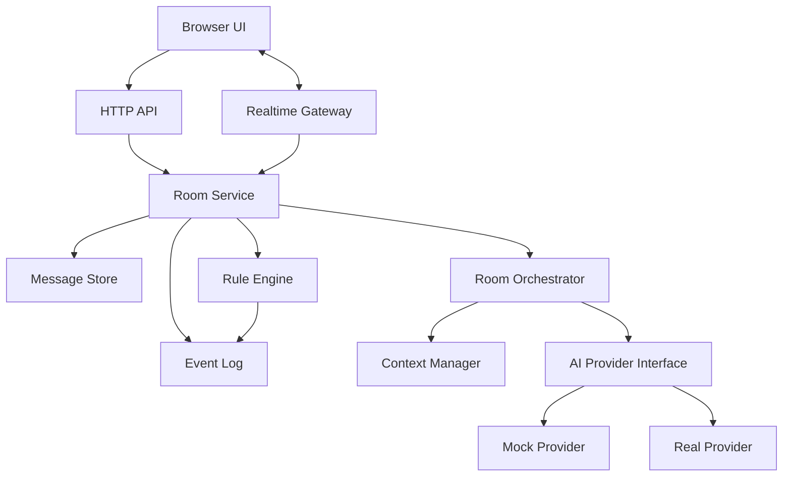

# 系统架构

## 架构目标

系统应先保持单体清晰，再为后续拆分保留边界。早期重点不是服务数量，而是模块职责明确、数据流可追踪、AI 调用可替换、实时事件可恢复。

## 推荐结构

## 模块职责

### Web UI

负责房间展示、消息输入、成员状态、AI 发言状态和游戏模式面板。UI 不直接修改权威状态，只向服务端提交命令。

### HTTP API

负责创建房间、查询房间、添加 AI、启动讨论、获取历史消息等请求响应式操作。

### Realtime Gateway

负责房间加入、离开、消息广播、AI 状态广播和游戏事件广播。实时网关不承载复杂业务判断。

### Room Service

负责房间生命周期、成员管理、消息写入和事件发布。它是讨论室业务的入口。

### Room Orchestrator

负责选择下一个发言的 AI、构造上下文、调用 Provider、写回 AI 消息。它不关心具体模型厂商。

### Context Manager

负责从房间消息、参与者、任务目标和私有状态中构造 Provider 输入。它必须处理上下文裁剪和可见性边界。

### AI Provider Interface

负责统一 mock 和真实模型调用。Provider 只处理输入到输出，不决定房间状态、不执行游戏规则。

### Rule Engine

负责游戏状态推进、行动合法性、阶段切换和胜负判断。AI 只能提交行动意图，不能直接修改游戏结果。

### Event Log

记录房间内发生的关键事件，包括消息、成员变化、AI 状态、游戏阶段和用户行动。事件日志用于断线恢复、调试和后续回放。

## 技术取舍

### Web 框架

建议第一阶段使用 Next.js + TypeScript。它能同时承载页面和 API，适合快速建立单体 Web 服务。若实时服务变重，再拆出 Fastify 或独立 WebSocket 服务。

### 实时协议

MVP 使用 Socket.IO 更务实。它提供房间广播、重连和心跳能力。若后续需要更强控制，可迁移到原生 WebSocket。

### 数据库

使用 PostgreSQL。房间、成员、消息适合关系模型；游戏状态、Provider 元数据和扩展字段可使用 JSONB。

### 持久化策略

同时保存消息表和事件表。消息表服务页面展示，事件表服务恢复、审计和调试。早期不实现完整 CQRS，只保留事件序号和 payload。

## 扩展边界

- 当 AI 调用耗时影响请求时，引入任务队列。
- 当 WebSocket 多实例部署时，引入 Redis pub/sub。
- 当游戏规则复杂后，将 Rule Engine 独立为明确模块。
- 当真实 Provider 增多后，增加 Provider registry，但不要过早平台化。